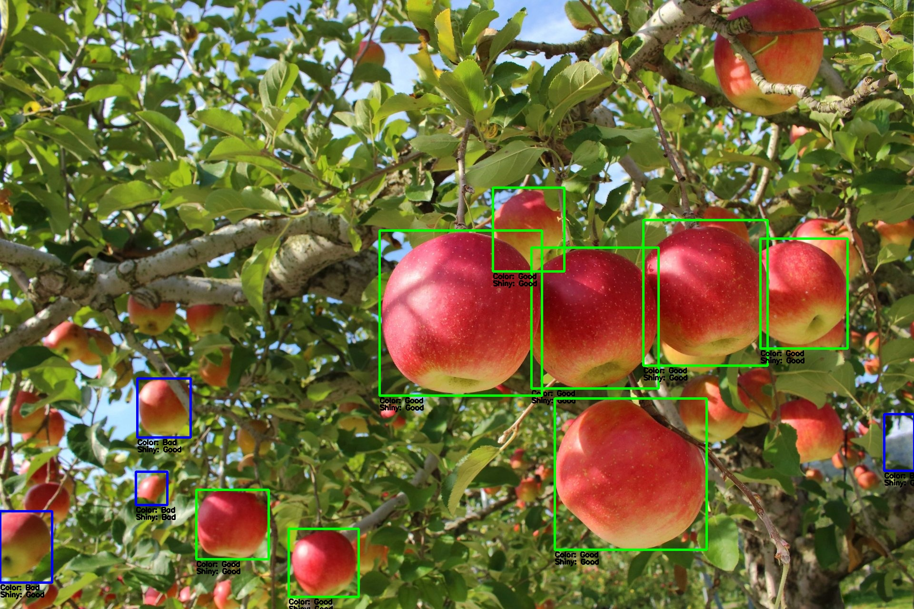

# Fruits Evaluator

Fruits EvaluatorはYOLOモデルを使用して入力画像から果物を検出し、各々の果物の色とツヤを評価するツールです。本リポジトリのプログラムはリンゴを検出します。

- 入力: (リンゴが写っている)画像
- 出力: 入力画像に各果物の評価結果を重畳表示した画像、評価結果と(写真内の)位置が格納されたcsv

## 必要条件

- Docker

## セットアップ手順

1. リポジトリをクローンします。
   ```bash
   git clone https://github.com/m-pub38/fruits-evaluator.git
   cd fruits-evaluator
   ```
2. 入力画像を準備し、./data/ ディレクトリに配置します。
3. Dockerイメージをビルド します。
   ```bash
   docker-compose build
   ```

## 使用方法
以下のコマンドでコンテナを実行できます。
   ```bash
   docker-compose run fruits_evaluator --in_image ./data/apple1.jpg
   ```
オプション引数は以下の通りです。
| 引数 | 説明 |
| :--- | :--- |
| --in_image | 入力画像のパス (必須) |
| --out_image | 出力画像のパス (省略時は evaluated_ が付く) |
| --out_csv | 出力CSVファイルのパス (省略時は evaluated_ が付く) |

## 実行例
赤くてツヤのある果物を緑枠、基準未満の果物を青枠で表示します。
(本リポジトリのプログラムはリンゴが対象です)

